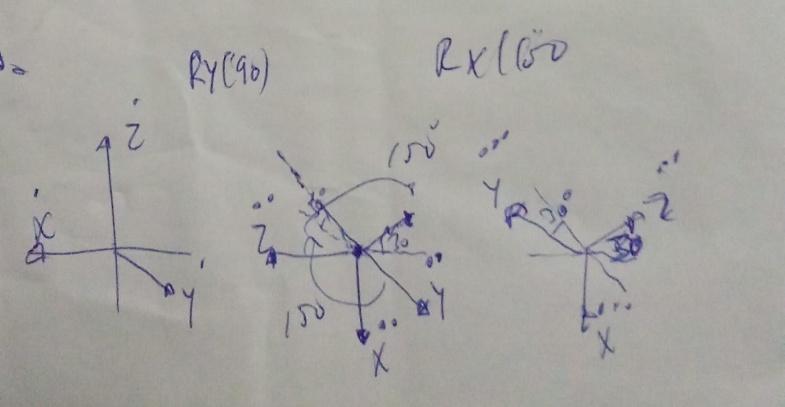
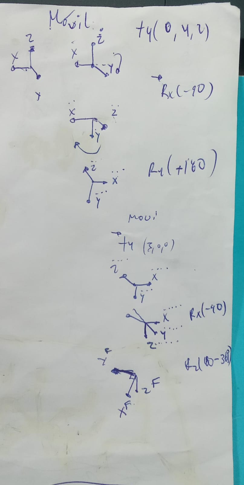
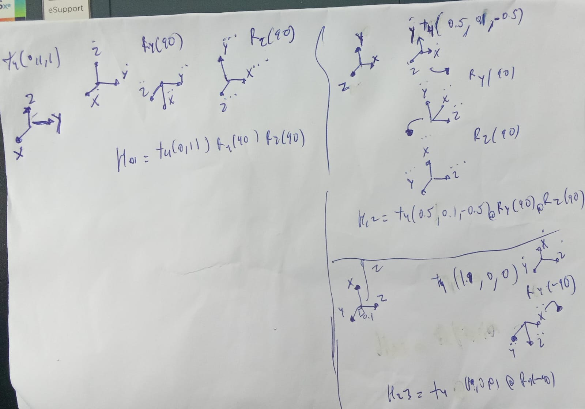

## clase 04 

- ejercicio04 


- ejercicio05 



- ejercicio6


- ejercicio7



## Clase 05 Cuaternios
Un cuertenio una representación matemática que describe una rotación <br>

Constituido por 4 componentes q0,q1,q2,q3 que representan las coordenadas del cuaternio en una base {e,i,j,k}<br>
- "e : q0" es la parte escalar
- y el resto es la parte vectorial

```bash
 Q = [q0,q1,q2,q3]  = [s,V]
```
### Interpretacion del Cuaternio
sea ``Q = q0 + q1 i + q2 j + q3 k``<br>
Si se quiere representar una ROTACIÓN theta en radianes ALREDEDOR de un eje (kx,kj,kz) unitario los componentes del cuaternio se calcularían :<br>
- q0 = cos(theta/2)
- q1 = kx sin(theta/2) 
- q2 = kj sin(theta/2)
- q3 = kz sin(theta/2)

### Cuaternio Conjugado 
A un cuaternio se le puede asociar su conjugado ,cambiando el signo a la parte vectorial<br>
Q* = [q0, -q1, .q2, q3]  = [s,-v]
- (Q*)* = Q
- (Q1 ° Q2 )*  = Q1* ° Q2*
- Q* = Q^-1

### Operaciones algebraicas con cuaternios
- Q1 ° Q2  = (s1,v1) ° (s2,v2) = (s1s2 -v1v2, v1xv2 +s1v2 +s2v1)<br>
- Q1 + Q2 = (s1 + s2, v1 + v2)
- aQ2 = a(s2,v2)
- (Q1 ° Q2) ° Q3 = Q1 ° (Q2 ° Q3)
- ||Q|| = (SUMA qi**2)**0.5
- Q* = (s, -v)
- Q^-1 = Q*/||Q||^2
- Q°Q^-1 = Q^-1°Q = (1,0,0,0) = e
### Utilización de cuaternios
- El cuaternio representa un giro theta sobre un vector unitario k<br>
Q = Rot(k,theta) = (costheta/2, k sintheta/2)<br>
- La rotacion Q alrededor de un vector r<br>
r' = Q° (0,r) ° Q*

### Composición de rotaciones
Q3 = Q2 ° Q1

### Rotaciones con traslaciones (movil)
- traslación p → rotacion Q 
(0, rxyz)  = Q ° (0, ruvw) ° Q* + (0, p)<br>
conocido r_uvw se obtiene r_xyz
- rotar Q → traslacion
(0,rxyz) = Q ° (0, ruvw + p) ° Q*

### Rotación con traslacion (fijo)
- traslacion r+p → rotacion Q
(0, r_prima) = Q °(0,r + p)° Q*

- rotacion Q → traslacion r+p
(0,r_prima) = Q ° (0,r)° Q* + (0,p)

