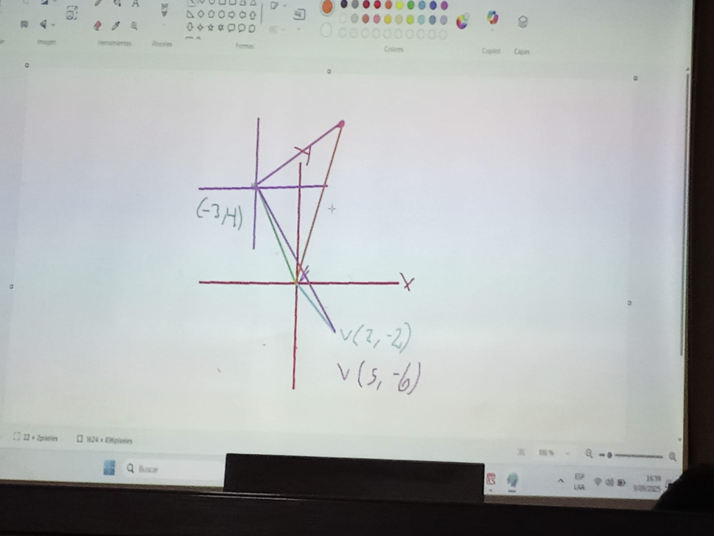
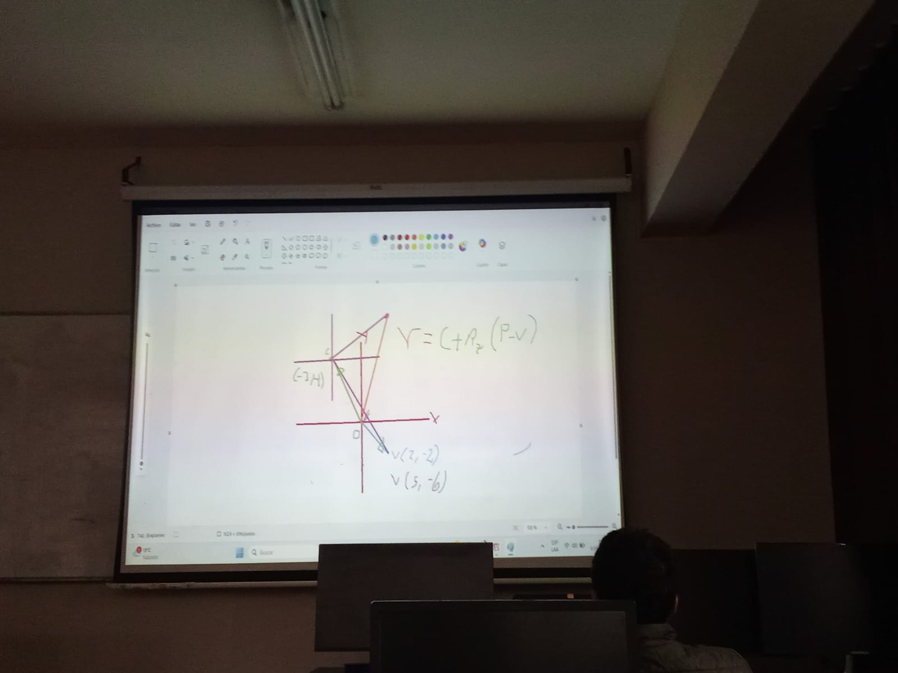

**introduccion**
la manipulacion de piezas impica movimiento espacial

tiene posicion y orientacion

la posicion y orientacion se hacen respecto a un sistema de referencia definido

**representacion de la posicion**
bidimensional, tiene 2 grados de libertad, la posicon queda definida por 2 componentes

se localiza un vector usando coordenadas polares 
``p(r, theta)``

        |
        |
------- |-------------
x : azimutal  r:radial,  
en el caso tridimensional se expresa en coordenadas cilindricas
z 
**conversiones**
x = rsen theta
y = rcos theta

esfericas
phi :0→pi   angulo polar
z = r cos phi 
x= r sin phi cos theta
y = r sin phi sen theta

**ejemplos**
**ejercicio1**
## Representacion de la orientacion
OXY  →  OUV 
fijo    movil
|
|------ 
P = px ix + py j y      1
P = pu iu + pv jv          2

1*ix
    Pix = px            a
    
2*ix
    Pix = pu iu ix + pv jv ix   b
    a = b
    px =  pu iu ix + pv jv ix 
    ....seguir la teoria

# En el ejercicio 3 no se esta transformando solo se esta rotando , es cuestion de temrinos 
el R representa GIRO (cambio de coorndaas) pero si le apico al W solo es giro 

imagen para trasladar y rotar 

